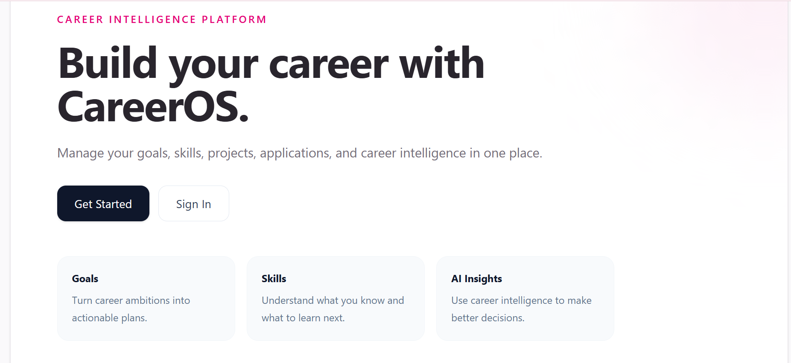
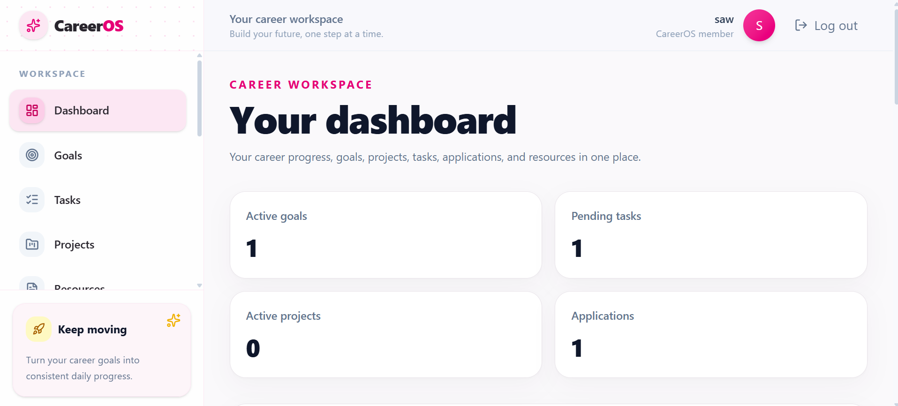
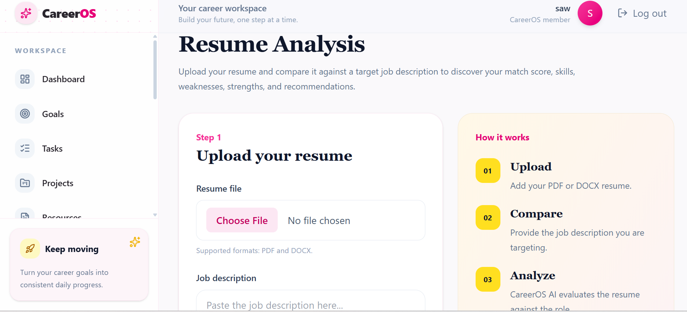
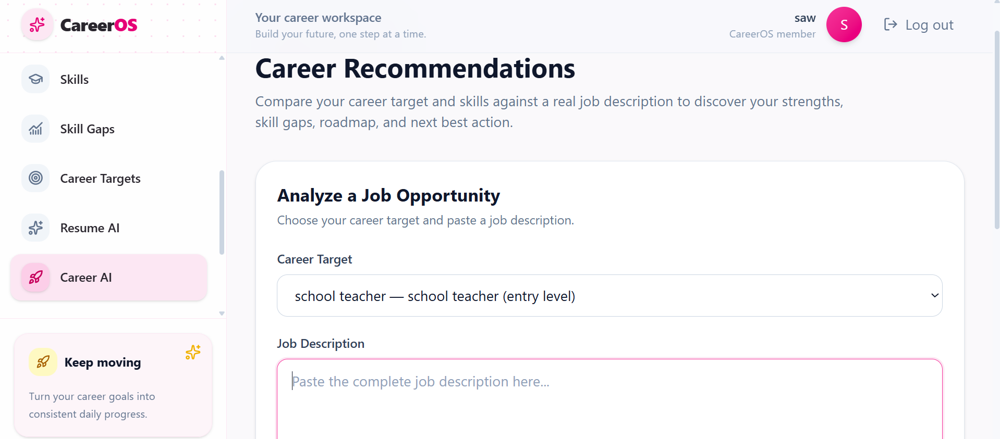
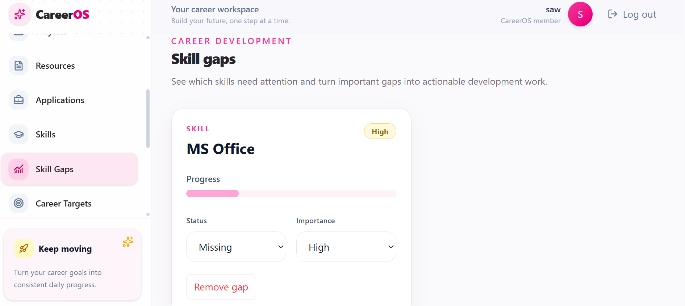

# CareerOS

> An AI-powered career management platform that helps users manage their goals, skills, projects, applications, resumes, and career development in one place.

## Live Demo

**[Try CareerOS](https://careeros-frontend.rashi-sai-470.workers.dev)**

## Preview

### Landing Page



### Dashboard



### Resume Analysis



### Career Recommendations



### Skill Gap Analysis



## About CareerOS

I built CareerOS as a full-stack project to understand how a real production-oriented application is designed beyond just creating individual pages and APIs.

The idea behind CareerOS is simple:

**Career development should be organized in one place instead of being scattered across different tools.**

CareerOS combines career planning, productivity tracking, application management, and AI-powered career intelligence into a single platform.

The application allows users to manage things such as:

- Career goals
- Tasks
- Projects
- Job applications
- Learning resources
- Skills
- Career targets
- Skill gaps
- Resume analysis
- AI-powered career recommendations

## Features

### Authentication

CareerOS includes:

- User registration
- User login
- JWT-based authentication
- Password hashing
- Protected API routes
- Protected frontend routes
- Persistent authentication state

### Career Dashboard

The dashboard gives users a centralized view of their career workspace.

It brings together information about:

- Active goals
- Pending tasks
- Projects
- Applications
- Career progress

### Goals

Users can create and manage career goals and turn larger career ambitions into actionable plans.

### Tasks

Users can create, update, complete, and manage tasks related to their career goals and development.

### Projects

CareerOS allows users to track projects and connect their career development work with practical projects.

### Job Applications

Users can manage their job applications and keep track of their application workflow.

### Resources

Users can save and manage useful learning and career resources.

## AI Features

One of the main reasons I built CareerOS was to understand how AI can be integrated into a real application instead of building a standalone AI demo.

### AI Resume Analysis

Users can upload a PDF or DOCX resume and compare it against a target job description.

The AI analysis provides information such as:

- Match score
- Matched skills
- Missing skills
- Strengths
- Weaknesses
- Recommendations
- Resume summary

The result is processed through the backend and stored so the application can work with the analysis later.

### Career Recommendations

CareerOS can analyze a user's career target, skills, and a job description to provide career-focused insights.

The workflow can identify:

- Strengths
- Skill gaps
- Career development recommendations
- Suggested roadmap
- Next best actions

### Skill Gap Analysis

Skill gaps can be tracked and turned into actionable development work.

CareerOS connects skill-gap information with career development activities such as:

- Tasks
- Projects
- Skill progress

This was designed to make the gap between **"I need to learn this"** and **"I am actually working on it"** smaller.

## Architecture

I designed the backend using a layered architecture so that different responsibilities stay separated.

```text
React Frontend
      │
      │ HTTP / REST
      ▼
FastAPI API Layer
      │
      ▼
Service Layer
      │
      ▼
Repository Layer
      │
      ▼
SQLAlchemy ORM
      │
      ▼
PostgreSQL
```


## Tech Stack

### Frontend

- React
- Vite
- Tailwind CSS
- React Router
- Lucide React
- React Hot Toast
- Vitest
- React Testing Library

### Backend

- Python
- FastAPI
- Pydantic v2
- SQLAlchemy 2.0
- PostgreSQL
- Alembic
- JWT Authentication
- Pytest

### AI

- OpenRouter
- AI provider/service layer
- AI-powered resume analysis
- Career recommendations
- Skill-gap analysis

### Deployment

- Cloudflare Workers
- Render
- PostgreSQL

### Tools

- Git
- GitHub
- Postman
- pgAdmin
- VS Code

## Security

Security was an important part of the project, especially because CareerOS handles authentication and resume-related data.

Current security-related implementation includes:

- JWT-based authentication
- Password hashing
- Protected API endpoints
- Protected frontend routes
- Backend-only AI API credentials
- Environment-variable based configuration
- Pydantic request validation
- Authentication and security integration tests
- Production environment configuration

## Project Structure

```text
CareerOs/
│
├── careeros-backend/
│   ├── app/
│   │   ├── api/
│   │   │   └── v1/
│   │   ├── core/
│   │   ├── models/
│   │   ├── repositories/
│   │   ├── schemas/
│   │   ├── services/
│   │   └── main.py
│   │
│   ├── alembic/
│   ├── tests/
│   ├── .env.example
│   └── requirements.txt
│
├── careeros-frontend/
│   ├── src/
│   │   ├── components/
│   │   ├── context/
│   │   ├── layouts/
│   │   ├── pages/
│   │   ├── routes/
│   │   ├── services/
│   │   └── test/
│   │
│   ├── .env.example
│   ├── package.json
│   ├── vite.config.js
│   └── wrangler.jsonc
│
├── screenshots/
│   ├── landing.png
│   ├── dashboard.png
│   ├── resume-analysis.png
│   ├── career-recommendations.png
│   └── skill-gaps.png
│
└── README.md
```
## About Me
I'm a Computer Science Engineering student interested in backend engineering, full-stack development, and AI-powered applications.
CareerOS is one of my main projects for learning how to design, build, test, and deploy a complete application instead of focusing only on individual technologies
